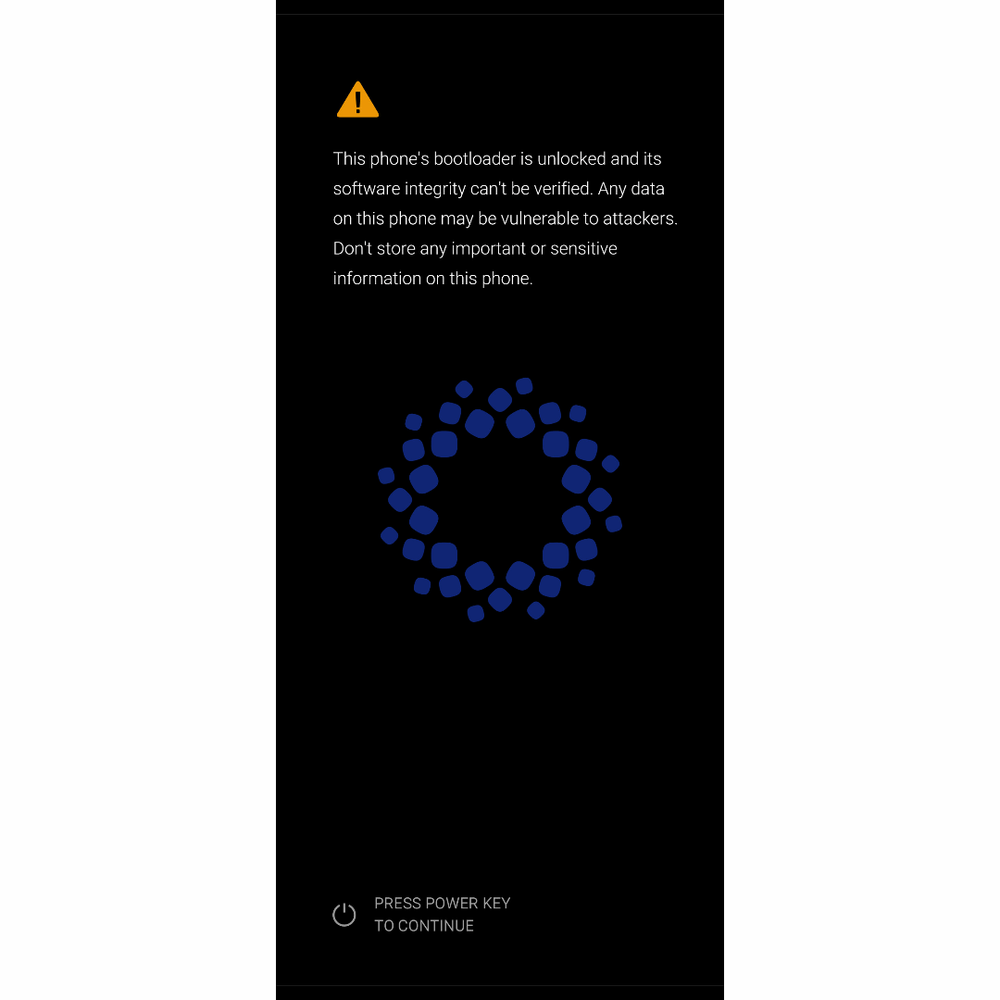

  <h1><u>custom bootlogos for samsung devices</u></h1>

<h3><i>Implements custom custom bootlogos for Samsung phones (after 2015?) with Magisk/KernelSU as its root solution/method.</i></h3>

These .bin files replace the default bootlogo with themed ones, offering a personalized boot-up experience :3

  <h3>All themes are provided as termux flashable .bin files. so just follow its guide on this repository</h3>

________________________________________________________________

| Theme | Preview | Download |
|-------|---------|----------|
| **HyperOS** |  | [download](https://github.com/Boffyz/Boot-animations-on-.zip-format-for_magisk-ksu/releases/download/bootanimation/Rainbow.AOKP.zip) |  |
| *More coming soon!* |  |  |  |

## Important Distinctions

1. This project targets the **bootlogo** that plays after the bootlogo, during the Android system startup.
2. They are not for samsung phones with stock (rooted) oneui as their os

## How It Works

the rom your on reads the up_param.bin file, which shows it based on its resolution and how its edited

## Installation Guide

1. **Download** your chosen bootlogo
2. **extract it**
3. **move** the up_param.bin file to the *root* of your internal storage (the directory that starts your internal storage).
4. go to *termux* and give it root permissions.
5. **paste** sudo dd if=/sdcard/up_param.bin of=/dev/block/by-name/up_param (or dd if=/sdcard/up_param.bin of=/dev/block/by-name/up_param if you haven't downloaded sudo on termux)
6. **Reboot** your device.
7. **Enjoy** the new boot bootlogo :3

## Credits

The .bin files used in this project are made by me, but credits goes to the images I've used

## How It Works

the samsung phone you're on reads the up_param.bin file, which shows it based on its resolution (duh)

## Important Notes

- these files are only for android based devices that are made by samsung.
- Use at your own risk—always back up your device before modifying system files.
- inspired by https://github.com/John0n1/SMbootFX

## Troubleshooting

- If the bootlogo doesn't change, ensure you've moved it to the right directory.

## Supported Devices

Most phones devices manufactured after 2015 are supported.

more specifically the ones that does not have adv-env.img inside of its up_param.bin file

Confirmed working on:

* **Galaxy A series:** A13 (A135F)

To confirm support for your specific device, check if yours has support for custom bootlogos

since this is for samsung exynos devices, check if it has this inside of its bootloader:

* `up_param.bin`

If that file is present, your device should be compatible.

## Contributions and Requests

Feel free to open an issue, feature requests, or new theme suggestions.  
Pull requests are welcome for new themes or improvements!

## Credits

The .bin files used in this project are made by me, and the image (that I added to these bootlogos) credits goes to their respective owner

## Notices

- This project is **not** affiliated with, sponsored, or endorsed by Samsung Electronics Co., Ltd., or any other mentioned or themed brands. All trademarks are the property of their respective owners.
- The `.bin` files are only distributed inside as replaceable files in the **Releases** section due to GitHub file size limitations.
- Be cautious when downloading forked versions—especially faulty `bootlogos` from unknown sources, as they may softbrick.

## License

This project is licensed under the [GNU General Public License](LICENSE).
